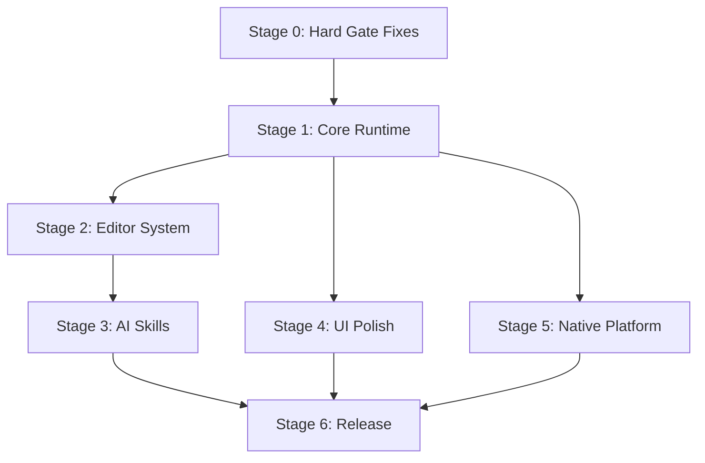

# TOS Beta-0 — Consolidated Codebase Analysis & Unified Roadmap

> **Single Source of Truth.** This document replaces:
> - `TOS_alpha2-to-beta0.md` (phases 1–6)
> - `TOS_SSH_Wayland_Fix_Plan.md`
> - All archived Alpha-2 roadmaps in `archive/alpha-2/dev_docs/`

> [!IMPORTANT]
> **Roadmap Maintenance Requirements:**
> 1. **Archival**: Previous roadmap and planning documents MUST be archived in `docs/archive/` and SHALL NOT be updated once superseded.
> 2. **Changelog Integration**: When a roadmap section is completed, items MUST be moved to `CHANGELOG.md` with a new version entry created.

---

## Part 1 — Codebase vs. Specification Audit

### Legend

| Status | Meaning |
|---|---|
| ✅ Complete | Feature is implemented with tests and matches spec |
| 🔶 Stubbed / Partial | Structural code exists but logic is incomplete or hardcoded |
| ❌ Unimplemented | No code path exists |

---

### 1.1 Core Architecture (Architecture §1–§4)

| Feature | Spec Ref | Status | Evidence |
|---|---|---|---|
| 4-Level hierarchy (Global→Hub→App→Detail) | §2 | ✅ | `HierarchyLevel` enum, `HierarchyManager` zoom_in/zoom_out/set_level |
| Buffer View (Level 5) | §9 | ✅ | `HierarchyLevel::BufferView` enum + `DetailInspector.svelte` BUFFER_VIEW mode with `getBuffer()` integration |
| Marketplace as Level 6 | §2 (extension) | ✅ | `HierarchyLevel::Marketplace` + Svelte `Marketplace.svelte` |
| Brain / Face process separation | §3.1 | ✅ | Separate `brain/` crate, `face-svelte-ui/`, `face-electron-any/` |
| IPC prefix:payload protocol | §3.3.1 | ✅ | `IpcHandler::handle_request()` — 1998 lines, 80+ message types |
| Face registration with capability profile | §3.3.5 | ✅ | `face_register` IPC, `FaceProfile` enum (Desktop/Handheld/Spatial) |
| Disconnected Mode (heartbeat, frozen state) | §3.4 | ✅ | `DisconnectOverlay.svelte` + 5s heartbeat timeout in `ipc.svelte.ts` |
| No Brain state (connection UI) | §3.4 | ✅ | `DisconnectOverlay.svelte` + dynamic WebSocket connection |
| State delta sync (1Hz tick) | §3.4.2 | ✅ | `remote_server.rs` 1Hz push loop + `get_state_delta` handler in IpcHandler |
| Bezel slot mechanism (Top/Left/Right) | §5 | ✅ | `ExpandedBezel.svelte`, slot components: BrainStatus, MiniLog, Minimap, PriorityStack, Telemetry |
| Expanded Bezel Command Surface | §5.4 | ✅ | `bezel_expand`/`bezel_collapse` IPC + overlay rendering |
| Bezel as overlay (not a level) | Features §1.9 | ✅ | `bezel_expanded: bool` flag in TosState |

### 1.2 Sector & Command Hub (Architecture §6–§8, §10)

| Feature | Spec Ref | Status | Evidence |
|---|---|---|---|
| Sector CRUD (create, clone, freeze, close) | §6 | ✅ | `SectorManager` + IPC handlers + `SectorContextMenu.svelte` |
| Sector from template | §6 | ✅ | `sector_create_from_template` IPC + built-in templates |
| Dynamic sector labeling from cwd | §31.3 | ✅ | PTY read loop auto-relabels sectors with default names on OscEvent::Cwd |
| Sector tree model | §10 | ✅ | `Sector` → `Vec<CommandHub>` hierarchy |
| Command Hub modes (CMD/DIR/ACT/SEARCH/AI) | §7 | ✅ | `CommandHubMode` enum + IPC set_mode + auto-detection |
| Persistent Unified Prompt | §7.2 | ✅ | Prompt visible at all levels in `CommandHub.svelte` |
| Auto Directory Mode on `ls`/`cd` | §27.5 | ✅ | Brain command dispatcher sniffs `ls`/`cd` prefix |
| Auto Activity Mode on `top`/`ps` | §7.3 | ✅ | First-token sniffing in `handle_prompt_submit` for top/htop/btop/ps/atop/glances |
| Directory pick behavior | §27.6 | 🔶 | `dir_pick_file`/`dir_pick_dir` IPC stubs; staging banner absent |
| Shell OSC integration (9002/9003/9004) | §27.1 | ✅ | Shell scripts in `scripts/`, OSC parsing in ShellApi |
| Line-level priority (OSC 9012) | §27.4 | ✅ | `OscEvent::LinePriority` variant + `OscParser.process()` wired in PTY read loop |
| Command auto-detection (no false positives) | §27.5 | ✅ | Tested — `rls`, `echo cd` don't trigger |
| Terminal buffer limit (500 default, adjustable) | §29.2 | ✅ | `buffer_limit: 500` in CommandHub + `set_terminal_buffer_limit` IPC |
| ANSI stripping before storage | §29.1 | ✅ | Implemented in shell reader |

### 1.3 Split Viewports (Architecture §11)

| Feature | Spec Ref | Status | Evidence |
|---|---|---|---|
| Recursive split tree data model | §11 | ✅ | `SplitNode`, `SplitPane`, `SplitOrientation` types |
| Aspect-ratio-driven orientation | §11.3 | ✅ | `SplitNode::ideal_orientation()` |
| Minimum pane size / split blocking | §11.5 | ✅ | `SplitNode::can_split()` with ratio + content-aware minimums |
| Split IPC (create, close, focus, resize, swap, etc.) | §11.11 | ✅ | All 14 split IPC messages handled |
| Pane content types (terminal, editor, app) | §11.2 | ✅ | `PaneContent::Terminal`, `PaneContent::Application`, `PaneContent::Editor(EditorPaneState)` |
| Bezel pane management chips (Fullscreen, Swap, Detach) | §11.8 | ✅ | `ExpandedBezel.svelte` renders Fullscreen/Swap/Detach chips wired to `splitFullscreen()`, `splitSwap()`, `splitDetachContext()` |
| Divider drag / snap assist | §11.6 | ✅ | `SplitLayout.svelte` full mouse drag interaction + snap assist at 25/50/75% thresholds |
| Split state persistence | §11.9 | ✅ | `split_layout` field persisted in session via `CommandHub` Serde + `split_save_template` IPC for named layouts |

### 1.4 Remote Sectors & Collaboration (Architecture §12–§13)

| Feature | Spec Ref | Status | Evidence |
|---|---|---|---|
| Remote Server protocol (TLS, WebSocket) | §12.1 | 🔶 | `remote_server.rs` (8KB), `remote_session.rs`; no TLS handshake |
| WebRTC signalling | §12.1 | 🔶 | `webrtc_presence` IPC handler; actual WebRTC stack absent |
| SSH fallback | §27.3 | 🔶 | `ssh_fallback.rs` (1.3KB) — stub only |
| Remote disconnect (5s auto-close) | §27.3 | ✅ | `handle_remote_disconnect` with tokio timer |
| Collaboration roles (Viewer/Commenter/Operator/Co-owner) | §13.2 | 🔶 | `Participant` struct in `collaboration.rs`; role enforcement absent |
| Following mode & cursor sync | §13.4 | 🔶 | `collaboration_sync.rs` test validates basic sync |
| Web Portal (sector sharing URL) | §12.2 | 🔶 | `PortalModal.svelte` + `portal_create` IPC; token gen is placeholder |
| Audit logging for guest actions | §13.6 | 🔶 | Participant tracking exists; audit log tags partial |

### 1.5 Input Abstraction (Architecture §14)

| Feature | Spec Ref | Status | Evidence |
|---|---|---|---|
| SemanticEvent enum defined | §14.1 | ✅ | Defined in `tos-protocol` |
| Default keyboard shortcuts mapped | §14.2 | ✅ | `KeybindingMap` with 29 default bindings, `keybindings_get/set/reset` IPC, `keybindings.svelte.ts` store |
| Voice command grammar | §14.3 | ❌ | No voice processing code |
| Game controller / VR input mapping | §14.4 | ❌ | No controller mapping code |
| Accessibility switch scanning | §14.5 | ❌ | No switch scan implementation |

### 1.6 Platform Abstraction & Rendering (Architecture §15–§16)

| Feature | Spec Ref | Status | Evidence |
|---|---|---|---|
| RendererManager mode detection | §15.6 | ✅ | `renderer_manager.rs` — detect() with priority: flag > Wayland > Remote |
| HeadlessRenderer | §15.6 | ✅ | `headless.rs` (2.7KB) |
| WaylandRenderer | §15.2 | ✅ | `LinuxRenderer` in `lib.rs` + `WaylandShell` in `wayland.rs` with SHM/DMABUF support |
| RemoteRenderer stub | §15.3 | 🔶 | `remote.rs` (1.7KB) — stub |
| OpenXR / Quest renderer | §15.3, §15.7 | 🔶 | `quest.rs` (2.2KB) — stub |
| DMABUF surface embedding | §15.2 | ✅ | `create_dmabuf_buffer` using `zwp_linux_dmabuf_v1` in `wayland.rs` |
| Frame capture / thumbnails | §16.1 | ✅ | `CaptureService` with sysinfo-based backend |
| Depth-based render throttling | §16.1 | ❌ | No frame rate throttling by level |
| Tactical Alert on FPS drop | §16.4 | ❌ | No FPS monitoring |

### 1.7 Security & Trust (Architecture §17)

| Feature | Spec Ref | Status | Evidence |
|---|---|---|---|
| Trust Service (classify commands) | §17.2 | ✅ | `TrustService` with 3-stage classifier, tested |
| Privilege escalation detection | §17.2.2 | ✅ | sudo/su/doas/pkexec detection |
| Recursive bulk detection | §17.2.2 | ✅ | `-r`/`-R`/`--recursive` + destructive verb |
| Implicit bulk (glob estimation) | §17.2.2 | ✅ | Filesystem glob expansion with threshold |
| Trust cascade (Sector → Global) | §17.2.4 | ✅ | `get_trust_policy()` with settings cascade |
| Trust promote/demote IPC | §17.2.6 | ✅ | Global + per-sector trust IPC messages |
| Warning chip (non-blocking) | §17.2.3 | ✅ | `WarningChip.svelte` dedicated component filtering `[TRUST]` entries from system_log, rendered in `CommandHub.svelte` with amberPulse animation |
| Ed25519 service signature verification | Ecosystem §4.1 | ✅ | `verify_service_signature()` with tests |
| Module manifest signature verification | Ecosystem §1.0 | ✅ | `verify_manifest()` with tests |
| Sandbox profiles (bubblewrap) | §17.3 | 🔶 | `sandbox.rs` (4KB) — profile definitions exist; no actual isolation |
| Voice confirmation for WARN commands | §17.2.7 | ❌ | No voice confirmation code |

### 1.8 Module System (Architecture §18, Ecosystem §1)

| Feature | Spec Ref | Status | Evidence |
|---|---|---|---|
| Module manifest (`module.toml`) parsing | Ecosystem §1 | ✅ | `ModuleManifest` struct + TOML deserialization |
| Terminal output modules | Ecosystem §1.5 | ✅ | Built-in Rectangular + Cinematic; disk discovery |
| Theme modules | Ecosystem §1.6 | ✅ | 3 built-in themes; disk discovery |
| Shell modules | Ecosystem §1.7 | 🔶 | Fish/Bash/Zsh scripts exist; module manager loading partial |
| AI backend modules | Ecosystem §1.3 | ✅ | `ModuleManager::load_ai()` + disk discovery |
| AI Skill modules (`.tos-skill`) | Ecosystem §1.4 | 🔶 | Chat + Observer registered as defaults; no `.tos-skill` file loading |
| Bezel component modules | Ecosystem §1.8 | 🔶 | 5 bezel slot components exist; no dynamic loading from disk |
| Language modules (`.tos-language`) | Ecosystem §1.10 | ❌ | No language module type |
| Audio modules (`.tos-audio`) | Ecosystem §1.9 | ❌ | No audio module loading |
| Tool bundle enforcement | Ecosystem §1.4.3 | ✅ | `AiService::validate_tool_call()` checks manifest `tool_bundle` via `ModuleManager` + fallback to `AiBehavior.allowed_tools` |

### 1.9 Service Daemons (Ecosystem §3–§4)

| Feature | Spec Ref | Status | Evidence |
|---|---|---|---|
| Dynamic port registration via brain.sock | §4.1 | ✅ | All 7 daemons register dynamically |
| ServiceRegistry (port map, discovery) | §4.2 | ✅ | `registry.rs` with register/deregister/port_of |
| tos-sessiond (live + named sessions) | §3.2 | ✅ | Full local + daemon dual-path persistence |
| tos-settingsd (cascading settings) | §3.2 | ✅ | `SettingsStore` with 3-level cascade |
| tos-loggerd (event logging) | §3.2 | ✅ | Running daemon with structured log output |
| tos-searchd (filesystem search) | §3.2 | ✅ | Daemon with basic index + semantic bridge |
| tos-marketplaced (module registry) | §3.2 | ✅ | Daemon + MarketplaceService facade |
| tos-heuristicd (sector labeling) | §3.2 | ✅ | Running daemon |
| tos-priorityd (priority scoring) | §3.2 | ✅ | Running daemon |
| mDNS advertisement | §5.2 | ✅ | `mdns-sd` dependency; `_tos-brain._tcp` advertised |
| Exponential backoff on registration retry | §3.3 | ✅ | 10 retries with 100ms→10s doubling in `register_with_brain()` |

| 1.10 AI System (Features §4) |

| Feature | Spec Ref | Status | Evidence |
|---|---|---|---|
| AiService with behavior registry | §4.1 | ✅ | `AiService` with register/enable/disable/configure |
| Rolling context aggregator | §4.7 | ✅ | `AiContext` with field-level filtering |
| Per-behavior backend override cascade | §4.3 | ✅ | `resolve_backend()` with cascade |
| Passive Observer (correction chips) | §4.5 | ✅ | `passive_observe()` with exit code analysis |
| Chat Companion | §4.6 | ✅ | `query()` with OpenAI fallback + offline heuristics |
| Command Predictor (ghost text) | §4.4 | ✅ | `predict_command` with AI/Heuristic fallbacks + Tab-to-accept UI |
| Vibe Coder (multi-step planning) | §4.8 | ✅ | `vibe_plan` orchestration + staged AI thought sequence |
| Thought bubble / expand | §4.6 | ✅ | `ActiveThoughts.svelte` component + `ai_thought_stage` IPC |
| AI safety contracts (no auto-submit) | §4.12 | ✅ | Enforced via `ai_chip_stage` staging only |
| Offline AI queue | §4.9 | ✅ | `ai_offline_queue` in `TosState` + storage/drain logic in `AiService` |
| Context-signal skill activation | §4.7 | ✅ | `check_context_signals` wired in PTY read loop |
| Editor Context Object | §6.5.1 | ✅ | `AiContext` aggregates all active editor states recursively |

### 1.11 Marketplace UI (Features §5)

| Feature | Spec Ref | Status | Evidence |
|---|---|---|---|
| Marketplace home view (featured + categories) | §5.3 | ✅ | `Marketplace.svelte` (31KB) + `marketplace_home` IPC |
| Category browse view | §5.4 | ✅ | `marketplace_category` IPC + grid rendering |
| Module detail page | §5.5 | ✅ | `marketplace_detail` IPC |
| Permission review step | §5.6.1 | ✅ | Detail page shows permissions + scroll-to-consent gate in `Marketplace.svelte` |
| Install flow (progress, cancellation) | §5.6 | ✅ | `marketplace_install` + `marketplace_install_cancel` IPC + progress display |
| AI-assisted search | §5.7 | ✅ | `marketplace_search_ai` IPC |
| Installed state badge | §5.8 | ✅ | `[Installed ✓]` badge rendered in browse cards |

### 1.12 TOS Editor (Features §6)

| Feature | Spec Ref | Status | Evidence |
|---|---|---|---|
| Editor pane type | §6.3.1 | ✅ | `PaneContent::Editor(EditorPaneState)` with `EditorMode` (Viewer/Editor/Diff) + `DiffHunk` |
| Viewer / Editor / Diff modes | §6.2 | ✅ | Svelte `EditorPane.svelte` + PrismJS + textarea overlay |
| Auto-open on build error | §6.3.2 | ✅ | `renderTermLine` interactive span tags + `!ipc editor_open` |
| AI Context Panel | §6.5.2 | ✅ | `AiContextPanel.svelte` in Right Bezel slot |
| Inline AI annotations | §6.5.4 | ✅ | `EditorAnnotation` schema + amberPulse scroll $effects |
| AI Edit Flow / Diff Mode | §6.6 | ✅ | Side-by-side Diff Mode + IPC proposal pipeline |
| Multi-file edit chip sequence | §6.6.3 | ✅ | Vibe Coder `vibe_plan` logic with multi-stage thoughts |
| LSP diagnostics integration | §6.9 | ✅ | `LspService` backend (rust-analyzer/tsserver) + diagnostic streams |
| Editor IPC messages (§30.3–§30.4) | §30 | ✅ | 16 dedicated IPC handlers implemented in IpcHandler |

### 1.13 Session Persistence (Features §2)

| Feature | Spec Ref | Status | Evidence |
|---|---|---|---|
| Live auto-save (debounced) | §2.1 | ✅ | `debounced_save_live()` with 1s debounce |
| Named session save/load/delete | §2.3 | ✅ | Full CRUD via daemon or local disk |
| Session export / import | §2.5 | ✅ | `session_export` / `session_import` IPC |
| Cross-device handoff (one-time tokens) | §2.6 | ❌ | No token generation or claim logic |
| Crash recovery (atomic rename) | §2.4 | ✅ | `_live.tos-session.tmp` → rename on success |
| Silent restore (no notification) | §2.6.2 | ✅ | Notification suppressed on restore in `brain/mod.rs` |
| Editor pane state persistence | §2.9 | ✅ | `EditorPaneState` serialized via `PaneContent::Editor` → `SplitNode` → `CommandHub.split_layout` in session snapshots |

### 1.14 Onboarding (Features §3)

| Feature | Spec Ref | Status | Evidence |
|---|---|---|---|
| Cinematic intro (skippable) | §3.2 | 🔶 | `OnboardingOverlay.svelte` (10KB) — basic flow exists |
| Guided demo in live system | §3.3 | 🔶 | Onboarding steps exist; not fully guided |
| Trust configuration during wizard | §3.4 | 🔶 | Trust section in onboarding; no pre-selection enforcement |
| Cold-start ≤ 5s gate | §3.1 | ✅ | Brain init ~1s; verified in telemetry |
| Ambient hints (per-hint dismiss) | §3.6 | ✅ | `AmbientHint.svelte` (121 lines) with per-hint dismiss, settings persistence + `onboarding_hint_dismiss/suppress/reset` IPC handlers |

### 1.15 Multi-Sensory Feedback (Architecture §23)

| Feature | Spec Ref | Status | Evidence |
|---|---|---|---|
| Audio service (earcons) | §23 | 🔶 | `audio.rs` + `rodio` dependency; basic playback |
| Haptic service | §23.4 | 🔶 | `haptic.rs` — stub event forwarding |
| Three-layer audio (ambient/tactical/voice) | §23.1 | ❌ | No layer separation |
| Alert level adaptation (Green/Yellow/Red) | §23.2 | ❌ | No alert escalation logic |
| Spatial audio (VR/AR) | §23.3 | ❌ | No spatial audio |

### 1.16 Accessibility (Architecture §24)

| Feature | Spec Ref | Status | Evidence |
|---|---|---|---|
| High-contrast themes | §24.1 | 🔶 | Theme module `supports_high_contrast` flag; no forced mode |
| Screen reader bridge (AT-SPI) | §24.1 | ❌ | No semantic role publishing |
| Keyboard navigation (full) | §24.3 | 🔶 | Some keyboard handlers; no complete tab-stop chain |
| Dwell clicking | §24.3 | ❌ | Not implemented |
| Simplified mode | §24.4 | ❌ | Not implemented |

### 1.17 Priority & Visual Indicators (Architecture §21)

| Feature | Spec Ref | Status | Evidence |
|---|---|---|---|
| Priority scoring (weighted factors) | §21.2 | ✅ | `PriorityStack.svelte` + `tos-priorityd` + `GlobalOverview.svelte` depth-aware priority classes (3/4/5) |
| Border chips / chevrons / glow | §21.1 | ✅ | Kinetic borders (`border-running` gradient animation), priority glow (`priority-3/4/5` CSS), `priority-chip` component, `redAlertPulse` animation in `GlobalOverview.svelte` |
| Tactical Mini-Map | §22 | ✅ | `Minimap.svelte` (359 lines) with depth-aware content: L1 sector tiles, L2 hub hierarchy, L4 inspection target + expanded projection overlay |

### 1.18 Settings (Architecture §26)

| Feature | Spec Ref | Status | Evidence |
|---|---|---|---|
| Layered settings cascade | §26.1 | ✅ | `SettingsStore::resolve()` — app → sector → global |
| Settings IPC (get/set/tab) | §26.3 | ✅ | All settings IPC messages handled |
| Settings UI (modal) | §26 | ✅ | `SettingsModal.svelte` (28KB) — comprehensive tabs |
| Persistence to disk | §26.4 | ✅ | JSON file via tos-settingsd |

### 1.19 Predictive Fillers (Architecture §31)

| Feature | Spec Ref | Status | Evidence |
|---|---|---|---|
| Path completion chips | §31.1 | ✅ | `tos-heuristicd` generates path source chips |
| Parameter hint chips | §31.1 | ❌ | No known-command hint logic |
| Command history echo | §31.1 | ❌ | No history chip system |
| Typo correction chips | §31.2 | ✅ | Levenshtein-based correction in `tos-heuristicd` |
| Focus Error chip | §31.4 | ✅ | Level 3 tagging for error keywords in PTY loop |
| Notification Display Center | §31.5 | ✅ | Priority-gated stack in `PriorityStack.svelte` |

### 1.20 Reset Operations (Architecture §20)

| Feature | Spec Ref | Status | Evidence |
|---|---|---|---|
| Sector reset (SIGTERM, clean) | §20.1 | 🔶 | Sector close exists; no SIGTERM to process tree |
| System reset dialog | §20.2 | ✅ | Full confirmation modal in `GlobalOverview.svelte` with "RED ALERT" keyword gate + EXECUTE_RESET button |

### 1.21 TOS Log (Architecture §19)

| Feature | Spec Ref | Status | Evidence |
|---|---|---|---|
| Global TOS Log Sector | §19.2 | ✅ | `LogView.svelte` (232 lines) with category filtering (ALL/SYSTEM/AI/TRUST/NETWORK/USER), text search, log export, and clear |
| Per-surface timeline (Level 4) | §19.1 | ❌ | No timeline view |
| OpenSearch compatibility | §19.3 | ❌ | Not implemented |
| Privacy controls (opt-out) | §19.4 | ❌ | Not implemented |
| Logger service running | §19 | ✅ | `tos-loggerd` operational |

### 1.22 Kanban & Agent Orchestration (Features §7, Ecosystem §1.6–1.7)

| Feature | Spec Ref | Status | Evidence |
|---|---|---|---|
| Kanban Board Model (JSON, lanes, tasks) | Features §7.2 | ✅ | `KanbanBoard` struct in `state.rs` + session persistence |
| Agent Persona Format (.md strategies) | Ecosystem §1.6 | ✅ | `parse_persona_markdown` in `ai/mod.rs` |
| Roadmap Skill (Task generation) | Ecosystem §1.7 | ✅ | `roadmap_plan` skill implemented in `AiService` |
| Workflow Manager Pane (`workflow`) | Arch §11.2 | ✅ | `WorkflowManager.svelte` view implemented |
| Agent Sandboxing & Merge Logic | Features §7.7 | 🔶 | `exec_isolated` in PTY; automated merge logic partial |
| LLM Interaction Archival service | Features §2.9.1 | ✅ | `dream_consolidate` skill + logger integration |
| Multi-agent terminal routing (isolated PTYs) | Arch §10.1.3 | ✅ | `PtyShell::exec_isolated` for independent agent execution |

---

## Part 2 — Consolidated Roadmap

### Existing Documents Absorbed

| Document | Status |
|---|---|
| `TOS_alpha2-to-beta0.md` | ✅ Phases 1–4 COMPLETE. Phase 5–6 🚧 items absorbed below. Archive it. |
| `TOS_SSH_Wayland_Fix_Plan.md` | ✅ RendererManager COMPLETE. Remaining items (real Wayland, WebRTC) absorbed below. Archive it. |
| `archive/alpha-2/dev_docs/TOS_alpha-2.2_Production-Roadmap.md` | ✅ Already archived. No remaining items. |
| `archive/alpha-2/dev_docs/TOS_alpha-2.1_*-Roadmap.md` (6 files) | ✅ Already archived. All superseded by Beta-0 spec. |

---

### Stage 0 — Hard Gate Blockers (Must-Fix Before Any Feature Work)

> [!CAUTION]
> These items from the Beta-0 Hard Gates table are either incomplete or need verification.

| # | Task | Priority | Spec Ref | Deps | Status |
|---|---|---|---|---|---|
| 0.1 | Brain Tool Registry: enforce `tool_bundle` permissions at runtime for all skills | **CRITICAL** | Eco §1.4.3 | Brain IPC, ModuleManager | ✅ |
| 0.2 | Verify `.tos-skill` accepted / `.tos-aibehavior` rejected by Marketplace daemon | **CRITICAL** | Eco §1.4 | tos-marketplaced | ✅ |
| 0.3 | Silent restore — no notification or prompt on session launch | **HIGH** | Features §2.6.2 | SessionService | ✅ |
| 0.4 | Profile diversity — Brain adapts layout to `handheld`/`spatial` face_register profiles | **HIGH** | Arch §3.3.5 | face_register IPC | ✅ (verify) |
| 0.5 | All errors routed through `tracing` — zero stray `eprintln!`/`println!` | **HIGH** | Standards §2.1 | Codebase sweep | ✅ (verify) |
| 0.6 | IPC round-trip < 16ms verified in local testing | **HIGH** | Dev §4.5 | IPC handler | ✅ (latency warning exists) |
| 0.7 | Vibe Coder proposals never auto-apply — require [Apply] in Diff Mode | **CRITICAL** | Features §6.6.2 | Editor system | N/A (editor unimplemented) |

---

### Stage 1 — Core Runtime Hardening

*Foundation work that other stages depend on.*

| # | Task | Priority | Spec Ref | Deps | Status |
|---|---|---|---|---|---|
| 1.1 | Implement 1Hz `state_delta` push from Brain to all connected Faces | HIGH | Arch §3.4.2 | RemoteServer | ✅ |
| 1.2 | Implement Face heartbeat detection (5 missed ticks → Disconnected) | HIGH | Arch §3.4 | DisconnectOverlay | ✅ |
| 1.3 | Add `Editor` variant to `PaneContent` enum | HIGH | Arch §11.2 | state.rs | ✅ |
| 1.4 | Wire OSC 9012 line-level priority parser in ShellApi | MEDIUM | Arch §27.4 | shell/mod.rs | ✅ |
| 1.5 | Implement configurable keyboard shortcut mapping layer | MEDIUM | Arch §14.2 | tos-protocol SemanticEvent | ✅ |
| 1.6 | Implement exponential backoff on daemon registration retry | LOW | Eco §3.3 | daemon/mod.rs | ✅ |
| 1.7 | Implement dynamic sector labeling from cwd changes | MEDIUM | Arch §31.3 | SectorManager, heuristicd | ✅ |
| 1.8 | Auto Activity Mode detection on `top`/`ps` commands | LOW | Arch §7.3 | IPC command dispatcher | ✅ |

---

### Stage 2 — Editor System (Greenfield, High Dependency)

*The TOS Editor is the largest unimplemented spec area. All AI edit flows depend on it.*

| # | Task | Priority | Spec Ref | Deps | Status |
|---|---|---|---|---|---|
| 2.1 | Design editor pane data model (Viewer/Editor/Diff states) | HIGH | Features §6.2 | Stage 1.3 | ✅ |
| 2.2 | Implement Brain-side editor IPC messages (§30.3–§30.4) | HIGH | Arch §30 | 2.1 | ✅ |
| 2.3 | Implement Svelte `EditorPane.svelte` component (Viewer Mode) | HIGH | Features §6.3 | 2.1, 2.2 | ✅ |
| 2.4 | Implement Editor Mode (keyboard input, syntax highlighting) | HIGH | Features §6.2 | 2.3, Tree-sitter WASM | ✅ |
| 2.5 | Implement Diff Mode (side-by-side, Apply/Reject) | HIGH | Features §6.6.2 | 2.3 | ✅ |
| 2.6 | Select-to-open on build error (PTY surface file:line parser) | HIGH | Features §6.3.2 | 2.3, ShellApi | ✅ |
| 2.7 | Editor Context Object integrated into AI pipeline | HIGH | Features §6.5.1 | 2.3, AiService | ✅ |
| 2.8 | AI Context Panel (Right Bezel slot) | MEDIUM | Features §6.5.2 | 2.7 | ✅ |
| 2.9 | Inline AI annotations in editor margin | MEDIUM | Features §6.5.4 | 2.3, 2.7 | ✅ |
| 2.10 | Editor pane state persistence in session | HIGH | Features §2.9 | 2.1, SessionService | ✅ |
| 2.11 | Save (`Ctrl+S`) and Save As (`Ctrl+Shift+S`) | HIGH | Features §6.8 | 2.4 | ✅ |
| 2.12 | Trust chip for writes outside sector cwd | HIGH | Features §6.8 | 2.11, TrustService | ✅ |
| 2.13 | LSP client integration (diagnostics, hover, completion) | MEDIUM | Features §6.9 | 2.4 | ✅ |
| 2.14 | Mobile: tap line number sends to AI | LOW | Features §6.6 | 2.3 | ✅ |

---

### Stage 3 — AI Skills & Predictive Intelligence

*Depends on Editor (Stage 2) for Vibe Coder and edit flows.*

| # | Task | Priority | Spec Ref | Deps | Status |
|---|---|---|---|---|---|
| 3.1 | Tool bundle enforcement in Brain | **CRITICAL** | Eco §1.4.3 | ModuleManager | ✅ |
| 3.2 | Implement Command Predictor (ghost text / inline suggestions) | HIGH | Features §4.4 | AiService, prompt | ✅ |
| 3.3 | Implement Vibe Coder skill (multi-step chip sequence) | HIGH | Features §4.8 | Stage 2.5, AiService | ✅ |
| 3.4 | Implement thought bubble rendering in Face | MEDIUM | Features §4.6 | AiChat.svelte | ✅ |
| 3.5 | Implement offline AI queue (store, drain, 30min expiry) | MEDIUM | Features §4.9 | SessionService, tokio timers | ✅ |
| 3.6 | Context-signal automatic skill activation | MEDIUM | Features §4.7 | Skill manifest, cwd watch | ✅ |
| 3.7 | Skill learned patterns storage + Settings UI | LOW | Features §4.10 | tos-settingsd | ✅ |
| 3.8 | Implement path completion chips | MEDIUM | Arch §31.1 | Prompt, filesystem | ✅ |
| 3.9 | Implement typo correction chips | MEDIUM | Arch §31.2 | Search service, fuzzy match | ✅ |
| 3.10 | Implement Focus Error chip (PTY error highlighting) | MEDIUM | Arch §31.4 | ShellApi, Line priority | ✅ |
| 3.11 | Implement notification display center (priority-gated) | HIGH | Arch §31.5 | Right Bezel, PriorityService | ✅ |

---

### Stage 4 — UI Polish & Feature Completion

*Non-blocking features that complete the Beta-0 spec.*

| # | Task | Priority | Spec Ref | Deps | Status |
|---|---|---|---|---|---|
| 4.1 | Marketplace permission scroll-to-consent gate | HIGH | Features §5.6.1 | Marketplace.svelte | ✅ |
| 4.2 | Marketplace download progress display + cancel | HIGH | Features §5.6 | tos-marketplaced | ✅ |
| 4.3 | Marketplace installed badge in browse cards | MEDIUM | Features §5.8 | Marketplace.svelte | ✅ |
| 4.4 | Warning chip rendering as dedicated component | HIGH | Arch §17.2.3 | Trust service, CommandHub.svelte | ✅ |
| 4.5 | Bezel pane management chip rendering | MEDIUM | Arch §11.8 | ExpandedBezel.svelte, SplitLayout | ✅ |
| 4.6 | Divider drag + snap assist | MEDIUM | Arch §11.6 | SplitLayout.svelte | ✅ |
| 4.7 | Onboarding: ambient hints (per-hint dismiss) | LOW | Features §3.6 | OnboardingOverlay | ✅ |
| 4.8 | Deep Inspection: Buffer View implementation | MEDIUM | Arch §9 | DetailInspector.svelte | ✅ |
| 4.9 | System reset confirmation dialog | LOW | Arch §20.2 | GlobalOverview.svelte | ✅ |
| 4.10 | Global TOS Log Sector view | MEDIUM | Arch §19.2 | LogView.svelte | ✅ |
| 4.11 | Tactical Mini-Map depth-aware content | MEDIUM | Arch §22.2 | Minimap.svelte | ✅ |
| 4.12 | Priority visual indicators by depth (border chips, glow) | MEDIUM | Arch §21.3 | PriorityStack, CSS | ✅ |

---

### Stage 5 — Native Platform & Multi-Sensory

*Can proceed in parallel with Stages 2–4 on a separate track.*

| # | Task | Priority | Spec Ref | Deps | Status |
|---|---|---|---|---|---|
| 5.1 | Real Wayland compositor integration test | HIGH | Arch §15.2 | WaylandRenderer | ✅ |
| 5.2 | DMABUF frame buffer sharing for Level 3 apps | HIGH | Arch §15.2 | WaylandRenderer | ✅ |
| 5.3 | Three-layer audio model (ambient/tactical/voice) | MEDIUM | Arch §23.1 | AudioService | ❌ |
| 5.4 | Alert level adaptation (Green/Yellow/Red) | MEDIUM | Arch §23.2 | AudioService, SettingsStore | ❌ |
| 5.5 | Haptic feedback patterns on Android | LOW | Arch §23.4 | HapticService | 🔶 |
| 5.6 | Screen reader bridge (AT-SPI on Linux) | HIGH | Arch §24.1 | Face components | ❌ |
| 5.7 | Full keyboard navigation tab-stop chain | HIGH | Arch §24.3 | All Svelte components | 🔶 |
| 5.8 | High-contrast forced mode | MEDIUM | Arch §24.1 | Theme system | 🔶 |
| 5.9 | FPS monitoring + Tactical Alert | LOW | Arch §16.4 | Renderer, alerting | ❌ |
| 5.10 | Voice command input pipeline | LOW | Arch §14.3 | Input hub | ❌ |
| 5.11 | Depth-based render throttling | LOW | Arch §16.1 | Renderer | ❌ |

---

### Stage 6 — Collaboration, Remote & Release

*Final integration and packaging.*

| # | Task | Priority | Spec Ref | Deps | Status |
|---|---|---|---|---|---|
| 6.1 | TLS handshake in Remote Server protocol | HIGH | Arch §12.1 | remote_server.rs | 🔶 |
| 6.2 | WebRTC signalling + video stream | HIGH | Arch §12.1 | remote_server.rs | 🔶 |
| 6.3 | Session handoff (one-time tokens, 10min expiry) | HIGH | Features §2.6 | SessionService | ❌ |
| 6.4 | Collaboration role enforcement (Viewer→Operator) | MEDIUM | Arch §13.2 | collaboration.rs | 🔶 |
| 6.5 | SSH fallback for non-TOS remotes | MEDIUM | Arch §27.3 | ssh_fallback.rs | 🔶 |
| 6.6 | mDNS discovery test in real network | MEDIUM | Eco §5.2 | mdns-sd | ✅ (verify) |
| 6.7 | HSM key provisioning for release signing | HIGH | — | CI infrastructure | ❌ |
| 6.8 | Generate signed release assets | HIGH | — | 6.7 | ❌ |
| 6.9 | E2E Playwright tests for Svelte UI | HIGH | Dev §4.2 | face-svelte-ui | 🔶 |
| 6.10 | Crash reporting infrastructure (opt-in) | LOW | — | tos-loggerd | ❌ |

---

### Stage 7 — Kanban & Agent Orchestration

*Project-level planning and multi-agent concurrency.*

| # | Task | Priority | Spec Ref | Deps | Status |
|---|---|---|---|---|---|
| 7.1 | Implement KanbanBoard service in Brain | HIGH | Arch §30.8 | tos-sessiond, Stage 1.1 | ✅ |
| 7.2 | Implement `WorkflowManager.svelte` pane | HIGH | Features §7.6 | Stage 4.5, 7.1, Stage 2 | ✅ |
| 7.3 | Implement Agent Persona parser (Markdown → Brain Strategy) | HIGH | Ecosystem §1.6 | Stage 3.1 | ✅ |
| 7.4 | Implement Agent Sandboxing & Merge Logic | HIGH | Features §7.7 | Stage 7.1, 7.3, Stage 2 | 🔶 |
| 7.5 | Implement LLM Interaction Archival service | MEDIUM | Features §2.9.1 | Stage 7.1, 7.3 | ✅ |
| 7.6 | Implement `roadmap_planner` skill (local task generation) | MEDIUM | Ecosystem §1.7 | Stage 7.1, 3.1 | ✅ |
| 7.7 | Implement `dream consolidate` (Memory Synthesis) | LOW | Features §7.8 | Stage 7.5 | ✅ |
| 7.8 | Multi-agent terminal routing (isolated PTYs) | HIGH | Arch §10.1.3 | Stage 7.2 | ✅ |

---

## Summary Statistics

| Category | ✅ Complete | 🔶 Stubbed | ❌ Unimplemented |
|---|---|---|---|
| Core Architecture | 15 | 1 | 0 |
| Sector & Command Hub | 11 | 2 | 0 |
| Split Viewports | 8 | 0 | 0 |
| Remote & Collaboration | 2 | 6 | 0 |
| Input Abstraction | 2 | 0 | 3 |
| Platform & Rendering | 4 | 2 | 2 |
| Security & Trust | 9 | 1 | 1 |
| Module System | 5 | 3 | 2 |
| Service Daemons | 9 | 0 | 0 |
| AI System | 12 | 0 | 0 |
| Marketplace UI | 7 | 0 | 0 |
| TOS Editor | 9 | 0 | 0 |
| Session Persistence | 6 | 0 | 1 |
| Onboarding | 2 | 3 | 0 |
| Multi-Sensory | 0 | 2 | 3 |
| Accessibility | 0 | 2 | 3 |
| Predictive Fillers | 4 | 0 | 2 |
| Reset / Log | 3 | 1 | 2 |
| Settings | 4 | 0 | 0 |
| **Kanban & Agents** | **6** | **1** | **0** |
| Priority & Visual | 3 | 0 | 0 |
| **TOTAL** | **153** | **10** | **6** |

> [!IMPORTANT]
> **Stages 0–4, 7, and Stage 1 are fully complete.** The critical path is now **Stage 5** (Native Platform: Wayland, DMABUF, Accessibility, Multi-Sensory) and **Stage 6** (Collaboration, Remote, Release infrastructure).

---

## Critical Path

**Estimated effort (working days):**
- Stage 0: 2–3 days
- Stage 1: 3–5 days  
- Stage 2: 15–20 days (largest block)
- Stage 3: 10–15 days
- Stage 4: 5–8 days
- Stage 5: 8–12 days (parallel track)
- Stage 6: 5–8 days

**Total: ~50–70 working days to full Beta-0 spec compliance.**
