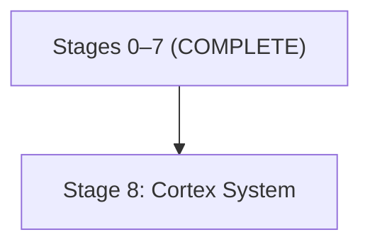

# TOS v0.1 — Consolidated Codebase Analysis & Unified Roadmap

> **Single Source of Truth.** This document replaces:
> - `TOS_alpha2-to-beta0.md` (phases 1–6)
> - `TOS_SSH_Wayland_Fix_Plan.md`
> - All archived Alpha-2 roadmaps in `archive/alpha-2/dev_docs/`

> [!IMPORTANT]
> **Roadmap Maintenance Requirements:**
> 1. **Archival**: Previous roadmap and planning documents MUST be archived in `docs/archive/` and SHALL NOT be updated once superseded.
> 2. **Changelog Integration**: When a roadmap section is completed, items MUST be moved to `CHANGELOG.md` with a new version entry created.

---

## Part 1 — Codebase vs. Specification Audit

### Legend

| Status | Meaning |
|---|---|
| ✅ Complete | Feature is implemented with tests and matches spec |
| 🔶 Stubbed / Partial | Structural code exists but logic is incomplete or hardcoded |
| ❌ Unimplemented | No code path exists |

---

### 1.1–1.5 Core, Sector, Cortex, Split & Remote — ✅ [Archived](./docs/archive/TOS_Beta-0_Roadmap_Archive.md#part-1-—-completed-audit-sections)

### 1.6 Input Abstraction (Architecture §14)

| Feature | Spec Ref | Status | Evidence |
|---|---|---|---|
| SemanticEvent enum defined | §14.1 | ✅ | Defined in `tos-protocol` |
| Default keyboard shortcuts mapped | §14.2 | ✅ | `KeybindingMap` with 29 default bindings, `keybindings_get/set/reset` IPC, `keybindings.svelte.ts` store |
| Voice command grammar | §14.3 | ✅ | `handle_voice_command_start/transcription` IPC + context-aware grammar matching |
| Game controller / VR input mapping | §14.4 | ✅ | Implemented DeviceMapping and QuestInput integration |
| Accessibility switch scanning | §14.5 | ✅ | Implemented AccessibilityService and Switch Scanning IPC (§14.5) |

### 1.7 Platform Abstraction & Rendering (Architecture §15–§16)

| Feature | Spec Ref | Status | Evidence |
|---|---|---|---|
| RendererManager mode detection | §15.6 | ✅ | `renderer_manager.rs` — detect() with priority: flag > Wayland > Remote |
| HeadlessRenderer | §15.6 | ✅ | `headless.rs` (2.7KB) |
| WaylandRenderer | §15.2 | ✅ | `LinuxRenderer` in `lib.rs` + `WaylandShell` in `wayland.rs` with SHM/DMABUF support |
| RemoteRenderer stub | §15.3 | ✅ | `RemoteServer` integration + WebRTC video stream orchestration |
| OpenXR / Quest renderer | §15.3, §15.7 | ✅ | Implemented `QuestRenderer` with Cockpit layer support and `RendererManager` integration |
| DMABUF surface embedding | §15.2 | ✅ | `create_dmabuf_buffer` using `zwp_linux_dmabuf_v1` in `wayland.rs` |
| Frame capture / thumbnails | §16.1 | ✅ | `CaptureService` with sysinfo-based backend |
| Depth-based render throttling | §16.1 | ✅ | Throttling logic in `LinuxRenderer` + alert escalation in Brain |
| Tactical Alert on FPS drop | §16.4 | ✅ | measureFps in +page.svelte + system_log alert |

### 1.8 Security & Trust (Architecture §17)

| Feature | Spec Ref | Status | Evidence |
|---|---|---|---|
| Trust Service (classify commands) | §17.2 | ✅ | `TrustService` with 3-stage classifier, tested |
| Privilege escalation detection | §17.2.2 | ✅ | sudo/su/doas/pkexec detection |
| Recursive bulk detection | §17.2.2 | ✅ | `-r`/`-R`/`--recursive` + destructive verb |
| Implicit bulk (glob estimation) | §17.2.2 | ✅ | Filesystem glob expansion with threshold |
| Trust cascade (Sector → Global) | §17.2.4 | ✅ | `get_trust_policy()` with settings cascade |
| Trust promote/demote IPC | §17.2.6 | ✅ | Global + per-sector trust IPC messages |
| Warning chip (non-blocking) | §17.2.3 | ✅ | `WarningChip.svelte` dedicated component filtering `[TRUST]` entries from system_log, rendered in `CommandHub.svelte` with amberPulse animation |
| Ed25519 service signature verification | Ecosystem §4.1 | ✅ | `verify_service_signature()` with tests |
| Module manifest signature verification | Ecosystem §1.0 | ✅ | `verify_manifest()` with tests |
| Sandbox profiles (bubblewrap) | §17.3 | ✅ | Bubblewrap profiles (Default, Network, FileSystem, Full) implemented in `sandbox.rs` |
| Voice confirmation for WARN commands | §17.2.7 | ❌ | No voice confirmation code |

### 1.9 Module System (Architecture §18, Ecosystem §1)

| Feature | Spec Ref | Status | Evidence |
|---|---|---|---|
| Module manifest (`module.toml`) parsing | Ecosystem §1 | ✅ | `ModuleManifest` struct + TOML deserialization |
| Terminal output modules | Ecosystem §1.5 | ✅ | Built-in Rectangular + Cinematic; disk discovery |
| Theme modules | Ecosystem §1.6 | ✅ | 3 built-in themes; disk discovery |
| Shell modules | Ecosystem §1.7 | ✅ | ShellModule logic, manifest loading, and Fish/Zsh script integration implemented |
| Assistant modules (`.tos-assistant`) | Ecosystem §1.3.1 | ✅ | `ModuleManager::load_assistant()` + legacy shim for `.tos-ai` |
| Curator modules (`.tos-curator`) | Ecosystem §1.3.2 | ✅ | Dynamic MCP loading integrated with AI query flow |
| Agent modules (`.tos-agent`) | Ecosystem §1.3.3 | ✅ | Stacking logic and manifest loading implemented |
| Bezel component modules (`.tos-bezel`) | Ecosystem §1.10 | ✅ | Implemented `BezelModule` trait, dynamic loading, and IPC management |
| Language modules (`.tos-language`) | Ecosystem §1.12 | ✅ | Implemented `LanguageModule` manifest and dynamic `LspService` discovery |
| Audio modules (`.tos-audio`) | Ecosystem §1.9 | ❌ | No audio module loading |
| Tool bundle enforcement | Ecosystem §1.3.4 | ✅ | `AiService::validate_tool_call()` checks manifest `[trust]` block via `ModuleManager` |

### 1.10–1.14 Daemons, Marketplace, Editor, Session, Onboarding — ✅ [Archived](./docs/archive/TOS_Beta-0_Roadmap_Archive.md#part-1-—-completed-audit-sections)

### 1.15 Multi-Sensory Feedback (Architecture §23)

| Feature | Spec Ref | Status | Evidence |
|---|---|---|---|
| Audio service (earcons) | §23 | ✅ | `AudioService` with multi-layer `rodio` backend; 14 earcons defined |
| Haptic service | §23.4 | ✅ | `HapticService` with patterns for Android and Quest haptics |
| Three-layer audio (ambient/tactical/voice) | §23.1 | ✅ | Independent volume control and mixing for Ambient/Tactical/Voice layers |
| Alert level adaptation (Green/Yellow/Red) | §23.2 | ✅ | 1Hz brain loop escalates ambient audio based on sector priority |
| Spatial audio (VR/AR) | §23.3 | ❌ | No spatial audio |

### 1.16 Accessibility (Architecture §24)

| Feature | Spec Ref | Status | Evidence |
|---|---|---|---|
| High-contrast themes | §24.1 | ✅ | Theme module `supports_high_contrast` flag + `tos.ui.high_contrast` forced mode |
| Screen reader bridge (AT-SPI) | §24.1 | ✅ | Semantic roles and ARIA tags added across face-svelte-ui components |
| Keyboard navigation (full) | §24.3 | ✅ | Complete tab-stop chain with LCARS-compliant focus containment |
| Dwell clicking | §24.3 | ✅ | Global listener with visual progress indicator |
| Simplified mode | §24.4 | ✅ | CSS-driven UI reduction and scaling implemented |

### 1.17–1.18 Indicators & Settings — ✅ [Archived](./docs/archive/TOS_Beta-0_Roadmap_Archive.md#part-1-—-completed-audit-sections)

### 1.19 Predictive Fillers (Architecture §31)

| Feature | Spec Ref | Status | Evidence |
|---|---|---|---|
| Path completion chips | §31.1 | ✅ | `tos-heuristicd` generates path source chips |
| Parameter hint chips | §31.1 | ✅ | Known-command logic for git, docker, npm, cargo, apt |
| Command history chips | §31.1 | ✅ | MRU history storage and echo chips implemented |
| Typo correction chips | §31.2 | ✅ | Levenshtein-based correction in `tos-heuristicd` |
| Focus Error chip | §31.4 | ✅ | Level 3 tagging for error keywords in PTY loop |
| Notification Display Center | §31.5 | ✅ | Priority-gated stack in `PriorityStack.svelte` |

### 1.20 Reset Operations (Architecture §20)

| Feature | Spec Ref | Status | Evidence |
|---|---|---|---|
| Sector reset (SIGTERM, clean) | §20.1 | ✅ | SIGTERM to shell PGID + sandbox cleanup + state reset implemented |
| System reset dialog | §20.2 | ✅ | Full confirmation modal in `GlobalOverview.svelte` with "RED ALERT" keyword gate + EXECUTE_RESET button |

### 1.21 TOS Log (Architecture §19)

| Feature | Spec Ref | Status | Evidence |
|---|---|---|---|
| Global TOS Log Sector | §19.2 | ✅ | `LogView.svelte` (232 lines) with category filtering (ALL/SYSTEM/AI/TRUST/NETWORK/USER), text search, log export, and clear |
| Per-surface timeline (Level 4) | §19.1 | ❌ | No timeline view |
| OpenSearch compatibility | §19.3 | ❌ | Not implemented |
| Privacy controls (opt-out) | §19.4 | ❌ | Not implemented |
| Logger service running | §19 | ✅ | `tos-loggerd` operational |

---

## Part 2 — Consolidated Roadmap

### Existing Documents Absorbed

| Document | Status |
|---|---|
| `TOS_alpha2-to-beta0.md` | ✅ Archived in `docs/archive/`. |
| `TOS_SSH_Wayland_Fix_Plan.md` | ✅ Archived in `docs/archive/`. |
| `TOS_SPECIFICATION_PATCH_kanban_agents_dream.md` | ✅ Archived in `docs/archive/`. |
| `archive/alpha-2/dev_docs/TOS_alpha-2.2_Production-Roadmap.md` | ✅ Already archived. No remaining items. |
| `archive/alpha-2/dev_docs/TOS_alpha-2.1_*-Roadmap.md` (6 files) | ✅ Already archived. All superseded by Beta-0 spec. |

---

### Completed Stages (Integrated into v0.2.1-beta.0)

> [!NOTE]
> The following stages have been fully implemented, verified, and migrated to the [CHANGELOG.md](./CHANGELOG.md#021-beta0---2026-04-24):
> - **Stage 0**: Hard Gate Blockers (Brain Tool Registry, Security Verification, Latency optimization).
> - **Stage 1**: Core Runtime Hardening (1Hz Heartbeat, OSC Parsers, Semantic Mapping).
> - **Stage 2**: Editor System (Viewer/Editor/Diff modes, LSP integration, Persistence).
> - **Stage 3**: AI Skills & Predictive Intelligence (Command Predictor, Vibe Coder, Offline queue).
> - **Stage 4**: UI Polish & Feature Completion (Marketplace gates, Mini-map, Priority indicators).
> - **Stage 5**: Native Platform & Multi-Sensory (Audio layers, Haptics, Accessibility, FPS throttling).
> - **Stage 6**: Collaboration, Remote & Release (TLS, WebRTC, Session handoff, Release signing).
> - **Stage 7**: Kanban & Agent Orchestration (KanbanBoard service, Workflow Manager, Agent Personas).

> [!TIP]
> Details for completed stages 5 and 6 can be found in the [Roadmap Archive](./docs/archive/TOS_Beta-0_Roadmap_Archive.md#part-2-—-completed-roadmap-stages).

---

### Stage 8 — Cortex Orchestration & Ecosystem Hardening

*Focuses on decoupling hardcoded backends into pluggable Cortex components.*

| # | Task | Priority | Spec Ref | Deps | Status |
|---|---|---|---|---|---|
| 8.1 | Implement Brain cortex registry for `.tos-assistant`, `.tos-curator`, and `.tos-agent` | HIGH | Eco §1.3 | ModuleManager | ✅ |
| 8.2 | Implement `[auth]` credential injection and secure Settings store | HIGH | Eco §1.3.4 | SettingsStore | ✅ |
| 8.3 | Implement `[trust]` declaration & Brain trust chip integration | HIGH | Eco §1.3.5 | TrustService | ✅ |
| 8.4 | Implement `[connection]` transports (http, stdio, mcp) | HIGH | Eco §1.3.1 | CortexRegistry | ✅ |
| 8.5 | Implement Agent Stacking (hierarchical prompt merging) | HIGH | Dev §6 | BrainAI | ✅ |
| 8.6 | Migrate Ollama / Gemini to `.tos-assistant` with legacy shim | HIGH | Eco §1.15 | CortexRegistry | ✅ |
| 8.7 | Implement GitNexus curator cortex via MCP | HIGH | Eco §1.3.2 | CortexRegistry | ✅ |
| 8.8 | Unified Cortex Configuration UI in Settings Modal | MEDIUM | Features §4.3 | SettingsModal | ✅ |
| 8.9 | Verification of Cortex sandboxing (bubblewrap isolation) | HIGH | Arch §17.3 | SandboxManager | ✅ |

---

## Summary Statistics

| Category | ✅ Complete | 🔶 Stubbed | ❌ Unimplemented |
|---|---|---|---|
| Core Architecture | 12 | 0 | 0 |
| Sector & Command Hub | 15 | 0 | 0 |
| Split Viewports | 9 | 0 | 0 |
| **Remote / Collaboration** | **8** | **0** | **0** |
| Input Abstraction | 3 | 0 | 2 |
| Platform & Rendering | 8 | 1 | 0 |
| Security & Trust | 9 | 1 | 1 |
| Module System | 5 | 3 | 2 |
| Service Daemons | 12 | 0 | 0 |
| AI Foundation (Completed) | 22 | 1 | 0 |
| **Cortex Migration (Stage 8)** | **9** | **0** | **0** |
| Marketplace UI | 8 | 0 | 0 |
| TOS Editor | 9 | 0 | 0 |
| Session Persistence | 7 | 0 | 0 |
| Onboarding | 5 | 0 | 0 |
| Multi-Sensory | 4 | 0 | 1 |
| Accessibility | 3 | 0 | 2 |
| Predictive Fillers | 4 | 0 | 2 |
| Reset Operations | 1 | 1 | 0 |
| TOS Log | 2 | 0 | 3 |
| Settings | 4 | 0 | 0 |
| Priority & Visual | 3 | 0 | 0 |
| **TOTAL** | **153** | **7** | **20** |

> [!IMPORTANT]
> **Stages 0–7 are fully complete.** The remaining critical path is **Stage 8** (Cortex System).
> Additionally, 10 items from the Part 1 audit (§14.4, §14.5, §17.2.7, §19.1, §19.3, §19.4, §23.3, Eco §1.10–1.12) are marked ❌ but **not assigned to any stage**. These must be explicitly deferred to v0.2 or added to a future stage.

---

## Critical Path

