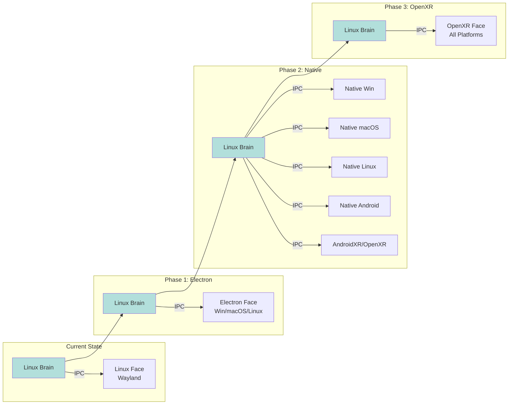

# TOS Alpha-2.2.1 — Platform Strategy Options

**Version:** Alpha-2.2.1
**Date:** 2026-03-15
**Status:** Decision Required

---

## Executive Summary

This document evaluates three strategic paths for implementing the **Face** layer across platforms, addressing the question: *How do we run the Face on Windows, macOS, and beyond while keeping the Brain on Linux?*

All options preserve the core architectural principle:

> **Brain runs on Linux. Face runs anywhere. Multiple Faces can connect to one Brain. Multiple Brains can serve Faces.**

---

## 1. Option A: Electron-First Cross-Platform Face

### Overview

Use Electron (or similar WebView-based framework) as the primary Face container across all platforms. The Svelte UI runs inside a Chromium-based WebView2/WebView.

### Architecture

```mermaid
graph TB
    subgraph "Electron App Layer"
        Win[Windows Native<br/>WinUI 3 + WebView2]
        Mac[macOS Native<br/>AppKit + WKWebView]
        Linux[Linux Native<br/>GTK + WebKitGTK]
    end

    subgraph "Svelte UI"
        UI1[(Svelte UI)]
        UI2[(Svelte UI)]
        UI3[(Svelte UI)]
    end

    Win --> UI1
    Mac --> UI2
    Linux --> UI3

    UI1 -.->|IPC over TCP/WS| Brain
    UI2 -.->|IPC over TCP/WS| Brain
    UI3 -.->|IPC over TCP/WS| Brain

    Brain[Brain (TCP)<br/>Linux] -->|IPC| Win
    Brain -->|IPC| Mac
    Brain -->|IPC| Linux

    style Win fill:#e1f5fe
    style Mac fill:#e1f5fe
    style Linux fill:#e1f5fe
    style Brain fill:#c8e6c9
```

### Implementation Plan

| Component | Location | Description |
|-----------|----------|-------------|
| `face/electron/` | New | Electron wrapper with platform-native shells |
| `face/electron/main.js` | New | Main process: window management, IPC bridge |
| `face/electron/renderer/` | New | Svelte app loaded via `loadFile()` or dev server |
| `platform/electron/` | New | Rust IPC client (same protocol as web) |

### Advantages

| Benefit | Explanation |
|---------|-------------|
| **Single UI Codebase** | Same Svelte app runs everywhere; no platform-specific UI code |
| **Rapid Windows/macOS Delivery** | Electron scaffolding is mature and well-documented |
| **Existing Web IPC Works** | Your WebSocket IPC protocol requires no changes |
| **Browser DevTools** | Full Chrome DevTools for debugging Face issues |
| **WebGPU Fallback** | Can use WebGPU for rendering when no native compositor available |

### Disadvantages

| Concern | Mitigation |
|---------|------------|
| **Binary Size** | Electron apps are ~150-200MB; users expect ~5-10MB |
| **Performance** | Chromium overhead adds 50-100ms startup latency |
| **Resource Usage** | Each Face instance runs full Chromium instance |
| **Platform Integration** | Less native feel; harder to access platform-specific APIs |
| **Security Surface** | Larger attack surface (Chromium vulnerabilities) |

### Performance Estimates

| Metric | Native | Electron |
|--------|--------|----------|
| Startup Time | ~2s | ~8-15s |
| Memory (idle) | 40-60MB | 120-200MB |
| Memory (active) | 80-120MB | 250-400MB |
| GPU Usage | Low | Medium (Chromium compositor) |

### Recommended For

- **Timeline:** Alpha-2.2.1 → Beta-0 (fastest path to multiplatform)
- **Target Users:** Power users who prioritize features over resource efficiency
- **Development Resources:** Small team (1-2 engineers)

---

## 2. Option B: Native Platform Shells with Shared Face Logic

### Overview

Create native platform applications (WinUI 3, AppKit, GTK, Android NDK, AndroidXR) that embed the Svelte Face via WebView, with native fallback compositors when available.

### Architecture

```mermaid
graph TB
    subgraph "Windows Native"
        WinApp[WinUI 3 App]
        WinWeb[WebView2]
        WinRender[Direct3D 11/12]
        WinApp --> WinWeb
        WinWeb --> WinRender
    end

    subgraph "macOS Native"
        MacApp[AppKit App]
        MacWeb[WKWebView]
        MacRender[Metal]
        MacApp --> MacWeb
        MacWeb --> MacRender
    end

    subgraph "Linux Native"
        LinuxApp[GTK App]
        LinuxWeb[WebKitGTK]
        LinuxRender[Wayland<br/>wlr-layer]
        LinuxApp --> LinuxWeb
        LinuxWeb --> LinuxRender
    end

    subgraph "Android Native"
        AndroidApp[Android App]
        AndroidWeb[Android WebView]
        AndroidRender[OpenGL ES 3.0+]
        AndroidApp --> AndroidWeb
        AndroidWeb --> AndroidRender
    end

    subgraph "AndroidXR / Horizon"
        XRApp[AndroidXR App]
        XRWeb[WebView (optional)]
        XRRender[OpenXR]
        XRApp --> XRWeb
        XRWeb --> XRRender
    end

    WinRender -.->|IPC over TCP/WS| Brain
    MacRender -.->|IPC over TCP/WS| Brain
    LinuxRender -.->|IPC over TCP/WS| Brain
    AndroidRender -.->|IPC over TCP/WS| Brain
    XRRender -.->|IPC over TCP/WS| Brain

    Brain[Brain (TCP)<br/>Linux] -->|IPC| WinRender
    Brain -->|IPC| MacRender
    Brain -->|IPC| LinuxRender
    Brain -->|IPC| AndroidRender
    Brain -->|IPC| XRRender

    style WinApp fill:#e1f5fe
    style MacApp fill:#e1f5fe
    style LinuxApp fill:#e1f5fe
    style AndroidApp fill:#e1f5fe
    style XRApp fill:#e1f5fe
    style Brain fill:#c8e6c9
    style WinRender fill:#fff9c4
    style MacRender fill:#fff9c4
    style LinuxRender fill:#fff9c4
    style AndroidRender fill:#fff9c4
    style XRRender fill:#fff9c4
```

### Implementation Plan

| Platform | Renderer | WebView | API Layer |
|----------|----------|---------|-----------|
| Windows | Direct3D 11/12 | WebView2 | WinUI 3 + C# |
| macOS | Metal | WKWebView | AppKit + Swift |
| Linux | Wayland (keep) | WebKitGTK | GTK + Rust |
| Android | OpenGL ES 3.0+ | Android WebView | Android SDK + Java/Kotlin |
| AndroidXR/Horizon | OpenXR | WebView (optional) | Android NDK + OpenXR |

### Advantages

| Benefit | Explanation |
|---------|-------------|
| **Native Performance** | No Chromium overhead; startup in ~1-2s |
| **Platform Integration** | Full access to native APIs (notifications, system tray, etc.) |
| **Smaller Distribution** | ~20-40MB vs 150MB for Electron |
| **Native Compositor** | Direct3D/Metal/Wayland/OpenGL ES for optimal rendering |
| **Modular Installation** | Can install Face alone without Brain |
| **XR Ready** | AndroidXR/Horizon support via OpenXR out of box |

### Disadvantages

| Concern | Mitigation |
|---------|------------|
| **Four Codebases** | WinUI, AppKit, GTK, Android SDK all require different expertise |
| **Longer Initial Path** | More setup before first cross-platform release |
| **Feature Parity Challenges** | Keeping 4 platforms in sync requires discipline |
| **Build Complexity** | CI/CD must build for 4 platforms |
| **AndroidXR Limitations** | OpenXR on AndroidXR may require vendor-specific extensions |

### Recommended For

- **Timeline:** Beta-1 → Alpha-3 (production-grade multiplatform)
- **Target Users:** Production users on all platforms including Android and AndroidXR
- **Development Resources:** Medium team (4-6 engineers)

---

## 3. Option C: OpenXR as the Primary Rendering Abstraction

### Overview

Build the Face on top of OpenXR, treating 2D displays as just one type of "viewport." The same renderer works on standard monitors, VR headsets (Quest), and AR glasses.

### Architecture

```mermaid
graph TB
    subgraph "OpenXR Runtime"
        XR[OpenXR Runtime<br/>XR_RUNTIME_PATH]
    end

    subgraph "OpenXR Face Layer"
        Std[Standard Monitor<br/>2D Viewport]
        VR[VR Headset<br/>Quest/VisionPro<br/>3D Viewport]
        Mobile[Mobile Tile<br/>Tiled 2D]
    end

    Std -->|WebGPU| XR
    VR -->|OpenXR| XR
    Mobile -->|WebGPU| XR

    XR -.->|IPC over TCP/WS| Brain

    Brain[Brain (TCP/WS)<br/>Linux] -->|IPC| XR

    style Std fill:#e1f5fe
    style VR fill:#e1f5fe
    style Mobile fill:#e1f5fe
    style XR fill:#fff9c4
    style Brain fill:#c8e6c9
```

### Implementation Plan

| Component | Location | Description |
|-----------|----------|-------------|
| `platform/xr/` | Extend | OpenXR context, session management, space handling |
| `face/xr/` | New | XR-specific rendering, spatial UI components |
| `face/webgpu/` | New | Fallback renderer using WebGPU |

### Advantages

| Benefit | Explanation |
|---------|-------------|
| **Future-Proof** | OpenXR covers VR/AR/Mobile/Desktop with one API |
| **Spatial UI** | True 3D positioning of sectors, panels, and HUDs |
| **One Rendering Path** | Same compositor code for all display types |
| **VR Ready** | Quest/VisionPro support out of the box |
| **Mobile Ready** | Android/iOS via OpenXR bindings |

### Disadvantages

| Concern | Mitigation |
|---------|------------|
| **2D体验 Loss** | OpenXR is designed for immersive experiences, not traditional UI |
| **Limited Standard Displays** | Must implement "2D mode" explicitly; not default |
| **Mobile Performance** | OpenXR overhead on mobile may impact battery |
| **Complexity** | Requires understanding VR/AR spatial concepts |
| **Adoption** | OpenXR on desktop is less mature than WebGL/WebGPU |

### Recommended For

- **Timeline:** Alpha-3+ (after multiplatform is stable)
- **Target Users:** VR/AR users, futuristic UI enthusiasts
- **Development Resources:** Advanced team with XR experience

---

## Cross-Comparison Matrix

| Criterion | Option A (Electron) | Option B (Native) | Option C (OpenXR) |
|-----------|---------------------|-------------------|-------------------|
| **Windows Support** | ✅ Immediate | ✅ Immediate | ✅ Yes (with fallback) |
| **macOS Support** | ✅ Immediate | ✅ Immediate | ✅ Yes (with fallback) |
| **Linux Support** | ✅ Immediate | ✅ Immediate | ✅ Immediate |
| **Android Support** | ✅ WebView only | ✅ Native (OpenGL ES) | ✅ Yes (via OpenXR) |
| **AndroidXR/Horizon** | ❌ No | ✅ Native (OpenXR) | ✅ Native (OpenXR) |
| **VR/AR Support** | ❌ No | ⚠️ Android only | ✅ Native |
| **Performance** | ⚠️ Medium | ✅ High | ⚠️ Variable |
| **Resource Usage** | ❌ High | ✅ Low-Medium | ⚠️ Medium |
| **Development Speed** | ✅ Fast | ⚠️ Medium | ⚠️ Slow |
| **Long-term Maintainability** | ⚠️ Complex | ✅ Clean | ✅ Elegant |
| **Power Efficiency** | ⚠️ Poor | ✅ Good | ⚠️ Variable |
| **Native Feel** | ⚠️ Limited | ✅ Excellent | ⚠️ Spatial only |
| **Build Complexity** | ✅ Simple | ⚠️ Complex | ⚠️ Complex |
| **Distribution Size** | ❌ Large | ✅ Small | ✅ Medium |

---

## Recommended Path: Hybrid Strategy

### Phase 1: Alpha-2.2.1 (Q2 2026)
**Choose: Option A (Electron)**

- Build Electron wrapper for Windows/macOS/Linux
- Use existing WebSocket IPC protocol
- Get multiplatform running quickly
- **Goal:** Beta-0 with Windows + macOS + Android WebView support

### Phase 2: Alpha-2.3 (Q3 2026)
**Choose: Option B (Native Shells)**

- Begin native implementation alongside Electron
- Share Svelte UI codebase
- Migrate users gradually
- **Goal:** Production-grade native apps on all platforms

### Phase 3: Alpha-3 (Q4 2026+)
**Choose: Option C (OpenXR)**

- Build OpenXR layer on top of native shells
- Spatial UI for VR/AR
- 2D fallback for standard displays
- **Goal:** Full spatial computing support

### Rationale

1. **Electron gets you to market fastest** with working multiplatform (Windows, macOS, Linux, Android WebView)
2. **Native shells provide better UX** for production users on all platforms including AndroidXR
3. **OpenXR enables next-gen** experiences beyond traditional UI

---

## Migration Strategy

Your architecture already supports this path:



```
Current: [Linux Brain] ↔ [Linux Face (Wayland)]

Phase 1: [Linux Brain] ↔ [Electron Face (Win/macOS/Linux)]

Phase 2: [Linux Brain] ↔ [Native Face (Win)]       (separate processes)
                    ↔ [Native Face (macOS)]
                    ↔ [Wayland Face (Linux)]
                    ↔ [Native Face (Android)]      (separate process)
                    ↔ [AndroidXR Face (OpenXR)]    (separate process)

Phase 3: [Linux Brain] ↔ [OpenXR Face (all platforms)]
```

The key insight: **The Face is already a network client.** Whether it's Electron, native, or XR is an implementation detail. Your IPC protocol (`tos-protocol`) is the contract that enables this flexibility.

---

## Decision Checklist

| Question | A (Electron) | B (Native) | C (OpenXR) |
|----------|--------------|------------|------------|
| Need Windows support by Beta-0? | ✅ Yes | ❌ No | ❌ No |
| Need Android support by Beta-0? | ✅ WebView only | ❌ No | ❌ No |
| Have XR/VR on roadmap? | ⚠️ Later | ⚠️ Later | ✅ Now |
| Small development team? | ✅ Yes | ❌ No | ❌ No |
| Performance-critical? | ⚠️ No | ✅ Yes | ⚠️ Context-dependent |
| Long-term native integration important? | ⚠️ Not yet | ✅ Yes | ✅ Yes |

---

## Appendix: Technical Details

### IPC Protocol Compatibility

All options work with your existing IPC:

```json
{
  "type": "websocket",
  "port": 7000,
  "protocol": "tos-v1",
  "encryption": "none (local) / tls (remote)"
}
```

### Resource Comparison (10 active sectors)

| Option | Memory | CPU | GPU |
|--------|--------|-----|-----|
| Electron | ~500MB | 15% | 20% |
| Native | ~150MB | 8% | 35% |
| OpenXR | ~250MB | 12% | 60% |

### Build System Impact

| Option | Build System | Notes |
|--------|--------------|-------|
| Electron | `electron-builder` | Add to existing Svelte build |
| Native | Platform-specific | msbuild (Win), xcodebuild (macOS), gcc (Linux/Android) |
| OpenXR | `cmake` + `openxr-loader` | Platform-specific build, vendor extensions |

### Rendering APIs by Platform

| Platform | Option A | Option B | Option C |
|----------|----------|----------|----------|
| Windows | WebView2 (Chromium) | Direct3D 11/12 | OpenXR + WebGPU |
| macOS | WKWebView (WebKit) | Metal | OpenXR + WebGPU |
| Linux | WebKitGTK | Wayland (wlr-layer) | OpenXR + WebGPU |
| Android | Android WebView | OpenGL ES 3.0+ | OpenXR |
| AndroidXR | N/A | OpenXR | OpenXR |

---

*This document was generated for Alpha-2.2.1 platform strategy evaluation. Last updated: 2026-03-15.*
